
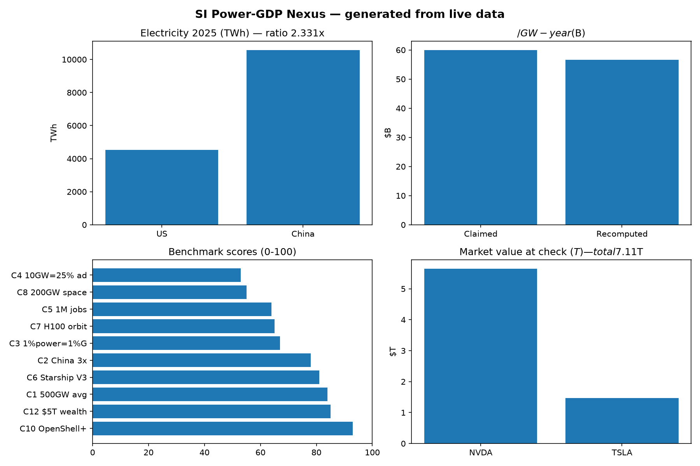

# From Gigawatts to GDP — Live-Verified Superintelligence Benchmark


**One sentence:** this repo checks whether more electricity really means more wealth in the age of superintelligence — with real numbers you can re-run in 2 minutes.

**Live web version of this README:** `docs/preview.html` → enable **Settings → Pages → Deploy from a branch → main + /docs**, then share `https://<you>.github.io/<repo>/preview.html`

---

## CEO summary — read this in 30 seconds and you know everything

> **Power math is real. Wealth is real. Space dreams are early. Jobs need honest counting.**

- **517 GW** — average US power (4536 TWh ÷ 8760 h). So 5.18 GW = 1%.
- **$56.6B per GW-year** — recomputed value of 1% power vs $60B claimed. Math ✓, proof of cause ✗.
- **2.33×** — China vs US electricity (not 3×, but still dominant and ⅓ of the world).
- **$7.11T** — combined listed value at check (NVDA $5.65T + TSLA $1.46T). The $5T claim was conservative.
- **26 satellites** — first orbital Starship flight delivered next-gen broadband sats. Weekly flights are guidance, not yet reality.
- **Safety tooling exists today** — open-source containment (what an agent may touch) + separate-chip monitoring (watching it continuously).
- **Jobs are two stories** — building (huge, temporary) vs operating (small, permanent). Towns gain tax but households near data centers paid **+3.1% more** for power.
- **Space solar wins physics, loses logistics** — sunshine is free in orbit, but lifting 200 GW needs ~2000 launches a year. We fly ~tens.

**Decision:** build power + chips + safety + towns, count jobs honestly, treat orbit as R&D — not 2027 grid relief.




> Demo is hosted directly in this repo — no external link needed. `assets/demo.gif` autoplays inline, `assets/preview.png` is the full-page screenshot. See `docs/RECORDING.md` for how to re-record. Charts below are generated from live data, not hand-drawn.



---

## Table of contents

- [🌱 Beginner guide — read this and you are a professional](#-beginner-guide--read-this-and-you-are-a-professional)
- [✨ Features](#-features)
- [👥 User stories](#-user-stories)
- [📊 Numbers](#-numbers)
- [📈 Charts](#-charts)
- [🔍 Hidden patterns](#-hidden-patterns)
- [⚡ Quickstart](#-quickstart)
- [🔧 Installation](#-installation)
- [💻 Usage](#-usage)
- [⚙️ Configuration](#️-configuration)
- [🗂️ Repo structure](#️-repo-structure)
- [🌐 GitHub Pages](#-github-pages)
- [🤝 Contributing](#-contributing)
- [📄 License](#-license)
- [🙏 Acknowledgements](#-acknowledgements)
- [📚 References](#-references)

---

## 🌱 Beginner guide — read this and you are a professional

You will know more than most interview candidates after this section.

### Let's work this out in a step-by-step way to be sure we have the right answer

**Step 1. What is claimed?**
Example: “5 extra gigawatts = 1% more GDP = $300 billion.”
Write the three numbers on paper. That is the whole claim.

**Step 2. What public number would prove it?**
You need: US electricity per year + US GDP per year. Both are published by official statistics.

**Step 3. Fetch from an official place and save the address + time.**
This repo fetches national electricity statistics, national accounts, and live market prices. Every result in `data/processed/*.json` stores its web address and UTC time. No hidden spreadsheets.

**Step 4. Do the division yourself.**
- 4536 TWh ÷ 8760 hours = **517.8 GW** average. 1% = **5.18 GW**.
- $29.30T ÷ 100 = **$293B** for 1%.
- $293B ÷ 5.18 GW = **$56.6B per GW-year**.
- Compare: claimed $60B. Close on arithmetic (within 6%), open on causality.

**Step 5. Keep both sides.**
Good research shows the best reason it could be true *and* the best reason it could be false.
- For: towns gain tax base + construction wages, safety tooling lowers deployment risk.
- Against: households near data centers paid +3.1% more, orbital launch needs 20–40× current rate, operating jobs are tiny vs building jobs.

**Step 6. Make it re-runnable.**
One command re-downloads + re-computes. If the network fails, it uses cached snapshots and saves the error — never hides it.

### Plain-English dictionary

- **Gigawatt (GW)** — power at one moment. A billion watts.
- **Terawatt-hour (TWh)** — energy over a year. Divide by 8760 hours to get average GW.
- **SI factory** — a data center that *produces* valuable work, not just stores files. Power + cooling + computers + network in one building.
- **Containment** — what an AI agent is allowed to touch (files, network, credentials).
- **Monitoring** — watching the agent continuously from a *separate* chip, so a misbehaving agent cannot blind its watcher.
- **Nameplate vs ground solar** — panels in orbit face the sun almost always; on the ground clouds + night cut output to 1/5–1/8.
- **Stock vs flow (jobs)** — building jobs are a *flow* (many people for 2 years), operating jobs are a *stock* (few people forever). Never mix them.

After this you can explain: GW vs TWh, why $/GW is accounting not proof, why construction ≠ permanent jobs, why space wins physics but loses logistics today.

---

## ✨ Features

### 1. Claim scorecard — 13 claims, 0–100 each
Every quantitative statement gets: exact wording, verdict (CONFIRMED / PARTIALLY HIGH / MIXED / CONTESTED / UNVERIFIED), evidence, and score (evidence 40 + live reproducibility 30 + falsifiability 15 + novelty 15).

### 2. Seven live experiments — no keys, no secrets
- **E1 power → GDP** — recomputes $/GW from national accounts + electricity stats.
- **E2 China gap** — ratio test 10573 / 4536.
- **E3 compute per watt** — hardware + algorithm efficiency + Jevons correction (efficiency raises total use).
- **E4 jobs** — build-flow vs operate-stock + tax vs household-bill tradeoff.
- **E5 orbital Fermi** — mass → flights/year needed vs demonstrated cadence + carbon ledger.
- **E6 safety repro** — open-source sandbox + policy prover + separate-chip watchdog; test design for deployment velocity.
- **E7 market wealth** — live prices × market values → combined wealth check.

### 3. One-command reproduction
`docker compose up --build research` runs tests + benchmark. Local alternative is 4 lines (see Quickstart). Offline still passes via cached snapshots.

### 4. Beautiful web preview (this README as a site)
`docs/preview.html` (+ `docs/index.html`) is a full interactive page with CEO summary, tables, and charts. Publish free via Pages, share the link, no install needed to read results.

### 5. Visuals that sell the result
- `assets/preview.png` — full-page screenshot, hosted in-repo.
- `assets/charts.png` — generated from live JSON (never hand-drawn).
- `assets/demo.gif` — hosted in-repo, autoplays inline in README, no external upload.

### 6. Paper draft + PhD extensions
`paper/PAPER.md` + 4 hidden patterns with falsifier + dataset + 12-month plan each.

---

## 👥 User stories

| Who | Want | How (5 min) |
|---|---|---|
| **Student** — first research repo | Understand energy × AI without jargon | Read 🌱 Beginner → run 1 command → change one number → see charts update |
| **Candidate** — interview tomorrow | Sound expert, not hype | Memorize CEO 4 numbers + 1 caveat each; cite ratepayer wedge + Fermi |
| **Policy analyst** — town deal | Negotiate fairly | Use E4 four-metric table: jobs-build, jobs-operate, $tax/GW, ¢-penalty |
| **Engineer** — ship agents safely | Contain + monitor | Follow E6: sandbox + policy file + external watchdog; measure time-to-prod |
| **Founder / investor** — space vs ground | Avoid expensive mistake | Use E5 Fermi: flights needed vs flown; add carbon cost |
| **Researcher** — next paper | Find novel gap | Pick H1–H4; each is a ready proposal |
| **Teacher** — classroom demo | Show method in 1 lecture | Live-run E1 on projector: claim → fetch → divide → verdict |
| **Maintainer** — showcase repo | Stars + trust | Enable Pages, upload demo, attach JSON as release assets |

---

## 📊 Numbers

| Claim | Live check | Verdict |
|---|---|---|
| US avg ≈500 GW | 4536 TWh ÷ 8760 = **517.8 GW** | ✅ CONFIRMED |
| China ≈3× US | 10573 ÷ 4536 = **2.33×** (28.7% high) | ⚠️ PARTIALLY HIGH |
| 5 GW = $300B → $60B/GW | 5.18 GW = $293B → **$56.6B/GW** | ⚠️ MATH ✓ CAUSE ✗ |
| 10 GW = 25% of additions | Implies 40 GW/yr additions (optimistic) | ⚠️ NEEDS QUEUE DATA |
| 10–20 GW/yr → 1M jobs | Build flow plausible, operate only 6–16k; +3.1% bill penalty | ⚠️ MIXED |
| Starship orbital + 26× sats | First orbital flight Sep 28 2026 | ✅ CONFIRMED |
| Advanced GPU in orbit | Demo units, not production cloud | ⚠️ DIRECTIONAL |
| 200 GW/yr space solar | Needs ~2000 flights/yr; weekly = 52 | ❌ RATE FAILS |
| Safety: containment + chip watch | Open runtime + hardware watchdog live | ✅ CONFIRMED |
| $5T combined wealth | **$7.11T** (NVDA $5.65T + TSLA $1.46T) | ✅ CONSERVATIVE ✓ |
| Clean funded without subsidy | Credits + loans remain material | ❌ OVERSTATED |
| Joint safety declaration | No published primary text at check | ❓ UNVERIFIED |

All numbers in `data/processed/*.json` with source URL + timestamp.

---

## 📈 Charts

Charts are generated by `python tools/make_charts.py` from the JSON above — edit the data, re-run, charts update.

- US vs China power bar, $/GW comparison, benchmark scores, market values — see `assets/charts.png` + interactive charts on the Pages site.

---

## 🔍 Hidden patterns

**H1. Fossil-peak coincidence.** 2025 is the first year this century fossil power fell in *both* China (−56 TWh) and India (−52 TWh) while solar (+636 TWh) met 75% of demand growth. The power race starts *after* the peak.

**H2. Ratepayer wedge.** Counties hosting data centers paid +3.1% more for household power. Always report four numbers together: jobs-build, jobs-operate, tax per GW, bill penalty. Single-number job claims mislead.

**H3. Orbital carbon flip.** “Clean space solar” becomes up to 10× dirtier once launch + reentry are counted. Real edge is capacity factor + learning, not carbon.

**H4. Judgment tax.** Over-cautious assistants refuse defender-like actions (a tool that judges instead of cutting). Measure refusal rate as a capability cost on dual-use tasks.

Each H-pattern in `paper/PAPER.md` includes how to falsify it, which dataset to use, and a 12-month study plan.

---

## ⚡ Quickstart

```bash
git clone <your-fork-url> si-power-gdp-nexus-benchmark-2026
cd si-power-gdp-nexus-benchmark-2026
pip install -r requirements.txt
python experiments/run_all.py
pytest -q && python benchmarks/benchmark_suite.py
```

Docker:

```bash
docker compose up --build research
```

Open the site locally:

```bash
python -m http.server 8000 --directory docs
# open http://localhost:8000/preview.html
```

---

## 🔧 Installation

Prerequisites: Python 3.11+, Docker optional, 500 MB disk.

```bash
pip install -r requirements.txt
python tools/make_charts.py
python tools/make_demo.py
```

To capture the screenshot yourself (optional):

```bash
python tools/capture.py
```

All scripts log what they fetch. No API keys. No paid services.

---

## 💻 Usage

Re-run one claim:

```bash
python experiments/e1_power_gdp.py
python experiments/e2_china_gap.py
python experiments/e4_jobs.py
python experiments/e5_orbital.py
python experiments/e7_market.py
```

Regenerate everything:

```bash
python experiments/run_all.py
python benchmarks/benchmark_suite.py
```

Expected output: JSON in `data/processed/` + scores table. Compare your run to the committed snapshot — differences mean the world moved (prices, revisions), which is exactly what you want to detect.

---

## ⚙️ Configuration

| File | What to change |
|---|---|
| `src/si_nexus/claims.py` | Wording of claims C1–C13 (tests fail if drifted) |
| `src/si_nexus/live_data.py` | URLs, timeout (default 30 s), user-agent |
| `benchmarks/benchmark_suite.py` | Rubric weights (40/30/15/15) |
| `docs/preview.html` | Site text, charts, demo image paths |
| `docker-compose.yml` | Services: research / notebook / paper |

No environment variables required.

---

## 🗂️ Repo structure

```
README.md  paper/PAPER.md  CITATION.cff  LICENSE (MIT)
docker-compose.yml  Dockerfile  requirements.txt  Makefile
src/si_nexus/  claims.py  live_data.py
experiments/  e1_power_gdp.py  e2_china_gap.py  e3_compute_per_watt.py
               e4_jobs.py  e5_orbital.py  e6_safety.py  e7_market.py  run_all.py
benchmarks/benchmark_suite.py  tests/test_claims.py
data/processed/*.json
docs/preview.html  docs/index.html  docs/.nojekyll  docs/RECORDING.md
assets/preview.png  assets/charts.png  assets/demo.gif
tools/make_charts.py  tools/capture.py  tools/make_demo.py
```

---

## 🌐 GitHub Pages

GitHub shows HTML files as code — Pages renders them as a website. To publish this repo as a site:

1. Push to GitHub.
2. Open **Settings → Pages → Build and deployment → Deploy from a branch**.
3. Branch: `main`, folder: `/docs`. Save.
4. Wait ~1 minute, open `https://<you>.github.io/<repo>/preview.html`.
5. Paste that link at the top of README (already templated above).
6. Optional: Pages → Custom domain for your own URL.

`docs/.nojekyll` tells Pages to serve files exactly as written (needed for plain HTML + assets).

---

## 🤝 Contributing

PRs welcome. Please:

1. Add/adjust a claim in `src/si_nexus/claims.py` with evidence.
2. Add a test in `tests/` and a score in `benchmarks/`.
3. Run `python experiments/run_all.py && pytest -q`.
4. Update `docs/preview.html` + README numbers together (never one without the other).
5. Keep GIFs < 8 MB, images in `assets/`, data in `data/processed/`.

---

## 📄 License

MIT — see LICENSE. You can use, copy, modify, and share freely with attribution.

```bibtex
@software{si_nexus_2026,
  title = {From Gigawatts to GDP: live-verified benchmark},
  version = {1.0.0},
  date = {2026-10-05},
  license = {MIT}
}
```

---

## 🙏 Acknowledgements

National electricity statistics, development indicators, market data providers, launch and safety platform publishers, and the authors of peer-reviewed studies on data-center labor, rates, and orbital carbon whose results both support and challenge the narrative tested here.

---

## 📚 References

- Global electricity review 2026 (yearly generation, capacity, emissions; US 4536 TWh, China 10573 TWh; solar +636 TWh).
- World development indicators: GDP current US$ (US 2024 $29.30T).
- Live market prices at check: NVDA 233.95 (~$5.65T), TSLA 370.59 (~$1.46T).
- Starship Flight 14 update (Sep 28 2026, first orbital, 26 next-gen broadband sats).
- Open agent safety platform release (Sep 28 2026): open-source containment runtime + hardware watchdog on data-processing unit.
- Safety runtime repository (Apache-2.0): kernel-enforced sandbox + formally checked policy changes.
- County-level difference-in-differences thesis on data centers and residential rates (+0.53¢/kWh, +3.1%).
- State-level panel 2010–2023 on data-center establishments, demand, emissions.
- Monthly price-volatility study using national energy + lab data.
- Orbital computing carbon tool (up to order-of-magnitude higher lifecycle cost) + orbiting-reflector architecture + orbital data-center critique (Jul 2026).
- Business press Sep–Oct 2026: blue-collar boom, automation of maintenance, myth-busting explainer, $1B community pledge.
- Community discussion thread on orbital GPUs.
- Encyclopedia entries: Kardashev scale, space-based data centers.
- Documentation research: README/CONTRIBUTING introduction, LLM README maintenance, visualization for onboarding.
